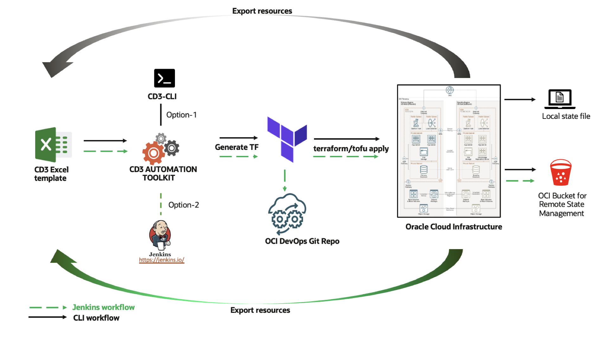

# **Getting Started**
---

 
!!! tip
    CD3 Automation toolkit can be used either via CLI or Jenkins.   
    📖 Detailed documentation and videos are provided for both options. Please check the left    panel for navigation.

-   :material-clock-fast:{ .lg .middle } __Overview__

    ---
    [Introduction](cd3-overview.md) 
    [Architecture](architecture.md) 
    [Services Supported](supportedservices.md) 
    [Excel Templates](excel-templates.md) 

-   :material-hammer-screwdriver:{ .lg .middle } __Installing CD3__

    ---
    [Prerequisites](prerequisites.md) 
    [Launch the container](launch-container.md) 
    [Launch Resource Manager Stack](launch-from-rmstack.md) 
    [Launch from Local Desktop](launch-from-local.md) 
    [Connect CD3 Container to OCI](connect-container-to-oci-tenancy.md) 

-   :material-monitor-screenshot:{ .lg .middle } __Use CD3 with CLI__

    ---
    [Before you Begin](cd3-cli.md) 
    [Create Resources from OCI using CLI (Greenfield Workflow)](greenfield-cli.md) 
    [OPA integration](opa-integration.md) 
    [Export Resources from OCI using CLI (Non-Greenfield Workflow)](nongreenfield-cli.md) 

-   :material-monitor-screenshot:{ .lg .middle } __Use CD3 with Jenkins__

    ---

    [Before You Begin](cd3-jenkins.md) 
    [Overview](jenkinsintro.md) 
    [Create Resources from OCI using Jenkins (Greenfield Workflow)](greenfield-jenkins.md) 
    [Provision multiple Services Together](multiple-services-jenkins.md) 
    [Export Resources from OCI using Jenkins (Non-Greenfield Workflow)](nongreenfield-jenkins.md) 
    [Commit Local changes to GIT](sync-cli-jenkins.md)    
    

-   :material-lightbulb-auto:{ .lg .middle } __MUST READ__

    ---
    [Manage Network](manage-network.md) 
    [Manage Compute](manage-compute.md) 
    [Manage OCI Network Firewall](manage-firewall.md) 
    

-   :material-feather:{ .lg .middle } __Additional Features__

    ---
    [Grouping generated TF files](group-tf-files.md) 
    [OCI Resource Manager Upload](resource-manager-upload.md) 
    [Support for Additional Attrs](additional-attributes.md) 
    [CIS Compliance Features](cisfeatures.md) 
    [CD3 Validator](cd3validator.md) 
    [Migrate jobs to user's Jenkins](jobs-migration.md) 
    [Remote Management of Terraform State](remotestate.md) 

-  :material-information:{ .lg .middle } __Troubleshooting__

    ---
    [Expected Behaviour](knownbehaviour.md) 
    [Common Issues](commonissues.md) 
    [FAQs](faq.md) 

-  :material-school:{ .lg .middle } __External References__

    ---
    [Learning Videos](learningvideos.md) 
    [Tutorials](tutorials.md) 

