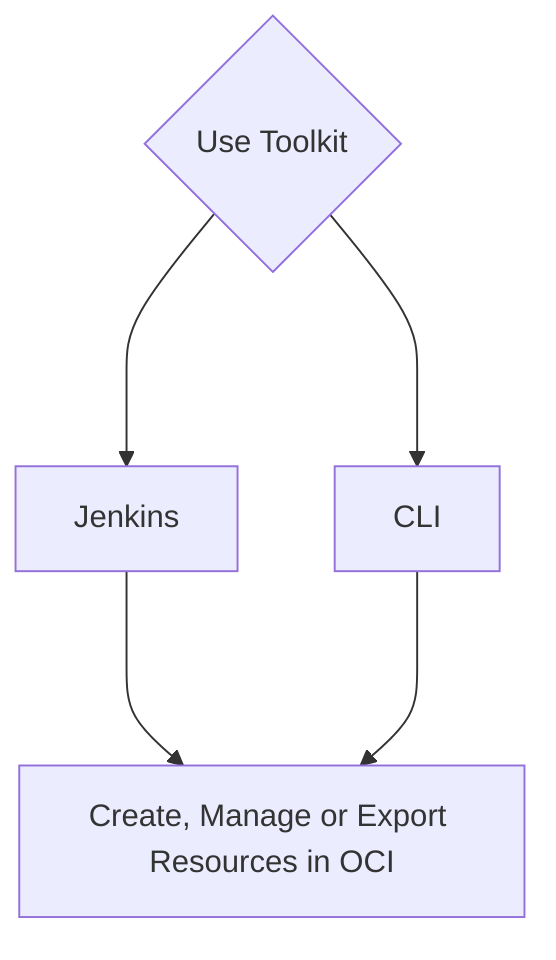

# **Connect container to OCI Tenancy**
---

!!! note 

    * With the toolkit release v2024.1.0, the toolkit supports single **customer_name** per container.
    * When a new region is subscribed to the tenancy, rerun createTenancyConfig.py by using the same tenancyconfig.properties file that was originally used. It will create new directory for the new region under `/cd3user/tenancies/<customer_name>/terraform_files` without touching the existing ones and will commit the latest terraform_files folder to DevOps GIT repo.

**Step 1 - Login (Exec) into the Container**:

* Run  
```
docker ps
```
&nbsp;
→ Note down the container ID from this cmd output.<br>

* Run  
  ```
  docker exec -it <container_id> bash
  ```

**Step 2 - Choose Authentication Mechanism for OCI SDK**</a>

* Click [here](authmechanisms.md) to configure any one of the available authentication mechanisms.
  
**Step 3 - Edit tenancyconfig.properties**:

* Run 
  ```
  cd /cd3user/oci_tools/cd3_automation_toolkit/user-scripts/
  ```

* Fill the input parameters in ```tenancyconfig.properties``` file.

!!! must-read "Must Read"
    - Have the details ready for Authentication mechanism you are planning to use.<br>
    - Review **outdir_structure_file** parameter as per requirements. It is recommended to use separate outdir structure to manage a large number of resources. <br>
    - Review Advanced Parameters Section for CI/CD setup. If you plan to use the toolkit with Jenkins then be ready with user details that will be used to connect to DevOps Repo in OCI.              Specifying these parameters as **'yes'** in properties file will create Object Storage Bucket and Devops Git Repo/Project/Topic in OCI and enable toolkit usage with Jenkins. The toolkit supports users in primary IDCS stripes or default domains only for DevOps GIT operations.<br>

<center>

</center>


 
**Step 4 - Initialise the environment**:

* Initialise your environment to use the Automation Toolkit.
```
python createTenancyConfig.py tenancyconfig.properties
```

!!! note 
    * If you are running container on a linux VM host(without using Resource Manager stack option), please refer to [point no. 7](faq.md) under FAQ   to avoid any permission issues.
    * Running the above command immediately after adding API key to the user profile in OCI might result in     Authentication Errors. In such cases, please retry after a minute.
    <br>


→ Example execution of the script with Advanced Parameters for CI/CD
    


**Output:**

<details>
    <summary> Details of the files created on successful execution of above steps - </summary>
    <table>
        <tr>
            <th>Files Generated</th>
            <th>At File Path</th>
            <th>Comment/Purpose</th>
        </tr>
        <tr>
            <td>setUpOCI.properties</td>
            <td>/cd3user/tenancies/<customer\_name>/<customer_name\>_setUpOCI.properties</td>
            <td>Customer Specific properties</td>
        </tr>
        <tr>
            <td>outdir_structure_file.properties</td>
            <td>/cd3user/tenancies/<customer_name\>/<customer_name>_outdir_structure_file</td>
            <td>Customer Specific properties file for outdir structure.
            This file will not be generated if 'outdir_structure_file' parameter was set to empty(single outdir)in tenancyconfig.properties while running createTenancyConfig.py</td>
        </tr>
        <tr>
            <td>Region based directories</td>
            <td>/cd3user/tenancies/<customer_name>/terraform_files</td>
            <td>Tenancy's subscribed regions based directories for the generation of terraform files.
                Each region directorywill contain individual directory for each service based on the parameter 'outdir_structure_file'</td>
        </tr>
        <tr>
            <td>Variables File,Provider File, Root and Sub terraform modules</td>
            <td>/cd3user/tenancies/<customer_name>/terraform_files/<region></td>
            <td>Required for terraform to work. Variables file and Provider file willbe genrated based on authentication mechanism chosen.</td>
        </tr>
        <tr>
            <td>out file</td>
            <td>/cd3user/tenancies/<customer_name>/createTenancyConfig.out</td>
            <td>This file contains acopy of information displayed as the console output.</td>
        </tr>
        <tr>
            <td>OCI Config File</td>
            <td>/cd3user/tenancies/<customer_name>/.config_files<customer_name>_oci_config</td>
            <td>Customer specific Config file for OCI API calls. This will havedata based on authentication mechanism chosen.</td>
        </tr>
        <tr>
            <td>Public and Private Key Pair</td>
            <td>Copied from /cd3user/tenancies/keys/ to /cd3usertenancies/ <customer_name>/.config_files</td>
            <td>API Key for authentication mechanism as API_Key arecopied to customer specific out directory locations for easy access.</td>
        </tr>
        <tr>
            <td>GIT Config File</td>
            <td>/cd3user/tenancies/<customer_name>/.config_files<customer_name>_git_config</td>
            <td>Customer specific GIT Config file for OCI Dev Ops GIT operations.This is generated only if use_oci_devops_git is set to yes</td>
        </tr>
        <tr>
            <td>S3 Credentials File</td>
            <td>/cd3user/tenancies/<customer_name>/.config_files/ <customer_name>_s3_credentials</td>
            <td>This file contains access key and secret for S3 compatible OSbucket to manage remote terraform state. This is generated only if use_remote_state is set to yes</td>
        </tr>
        <tr>
            <td>Jenkins Home</td>
            <td>/cd3user/tenancies/jenkins_home</td>
            <td>This folder contains jenkins specific data. Single Jenkins instance can be setup for a single container.</td>
        </tr>
        <tr>
            <td>tenancyconfig.properties</td>
            <td>/cd3user/tenancies/<customer_name>/.config_files/ <customer_name>_tenancyconfig.properties</td>
            <td>The input properties file used to execute the script is copied to custome folder to retain for future reference. This can be used when the script needs tobe re-run with same parameters at later stage.</td>
        </tr>
        
    </table>

</details>
<br>
The next pages will guide you to use the toolkit either via CLI or via Jenkins. Please proceed further.

[Use Toolkit with CLI](#){ .md-button } [Use Toolkit with Jenkins](#){ .md-button }