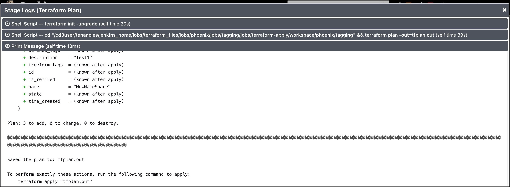

# **Create and Manage Resources in OCI (Greenfield Workflow)**

## Execute setUpOCI Pipeline

**Step 1**: 
 Choose the appropriate CD3 Excel sheet template from [Excel Templates](excel-templates.md).
Fill the CD3 Excel with appropriate values.

**Step 2**:
 Login to Jenkins URL with the user created after initialization and click on **setUpOCI pipeline** from Dashboard. Click on **'Build with Parameters'** from left side menu.

!!! note
     Only one user at a time using the Jenkins setup is supported in the current release of the toolkit.

**Step 3**:
 Upload the above filled Excel sheet in **Excel_Template** section.

 

!!! info 
    This will copy the Excel file at `/cd3user/tenancies/<customer_name>` inside the container. It will also take backup of existing Excel on the container by appending the current datetime if same filename is uploaded in multiple executions.

**Step 4:** 
 Select the workflow as **Create New Resources in OCI(Greenfield Workflow)**. Choose single or multiple MainOptions as required and then corresponding SubOptions.
  Check out [this](multiple-services-jenkins.md) while selcting multiple options simultaneously.
 Below screenshot shows creation of Compartments (under Identity) and Tags.

 

Click on **Build** at the bottom.

**Step 5:** 
 setUpOCI pipeline is triggered and stages are executed as shown below. 
This will run the python script to generate the terraform auto.tfvars.  Once created, it will commit to the OCI Devops GIT Repo and then it will also launch terraform-apply pipelines for the services chosen (Stage:phoenix/identity and Stage:phoenix/tagging in the below screenshot).

## Execute terraform Pipelines
Terraform pipelines are auto triggered parallely from setUpOCI pipeline based on the services selected (the last two stages in above screenshot show trigger of terraform pipelines).  

**Step 1**: 

Click on 'Logs' for Stage: phoenix/identity and click on the pipeline link.
 
> ***Note - Navigating to Dashboard displays pipelines that are in running state at the bottom left corner.*** 
> ***Or you can also navigate from Dashboard using the region based view (Dashboard -> phoenix View -> service specific pipeline)*** 
 
> ***In this example it would be:***  
> &emsp; ***terraform_files » phoenix » tagging » terraform-apply***  
> &emsp; ***terraform_files » phoenix » identity » terraform-apply***  

**Step 2**: 
 Stages of the terraform pipeline for apply are shown below:

 

**Step 3**:
 Review Logs for Terraform Plan and OPA stages by clicking on the stage and then 'Logs'. 

 

**Step 4**: 
 'Get Approval' stage has timeout of 24 hours, if no action is taken the pipeline will be aborted after 24 hours. Click on this stage and click 'Proceed' to proceed with terraform apply or 'Abort' to cancel the terraform apply.

 

**Step 5**:
 Below screenshot shows Stage View after clicking on 'Proceed'. Login to the OCI console and verify that resources got created as required.

 

**Step 6**:
 Similarly click on 'Logs' for Stage: phoenix/tagging and click on the pipeline link and 'Proceed' or 'Abort' the terraform apply  

  

