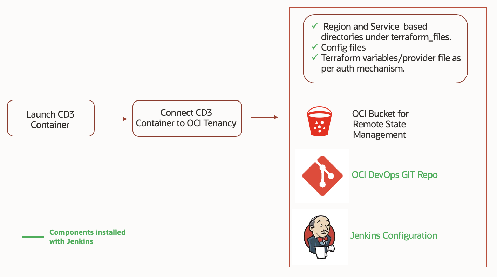

1. Configure <a href = "../prerequisites"><u>Prerequisites</u></a>
2. <a href="../launch-container"><u>Launch CD3 Container</u></a>
3. <a href="../connect-container-to-oci-tenancy"><u>Connect CD3 Container to OCI</u></a>

 
At the end of the installation, a fully configured container will be available to start generating terraform for OCI resources.

 
