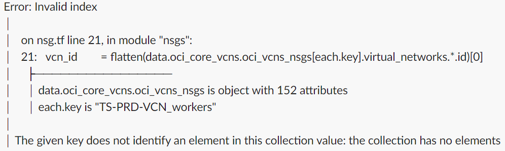

# Expected Behaviour Of Automation Toolkit

!!! note 
    1. Automation Tool Kit *DOES NOT* support the creation/export of duplicate resources. 
    2. Automation Tool Kit *DOES NOT* support sharing of Block Volumes.

!!! WARNING
    1. DO NOT modify/remove any commented rows or column names. You may re-arrange the columns if needed.
    2. A double colon (::) or Semi-Colon (;) has a special meaning in the Tool Kit. Do not use them in the OCI data / values.
    3. Do not include any unwanted space in cells you fill in; do not place any empty rows in between.
    4. Any entry made/moved post \<END> in any of the tabs of CD3 will not be processed. Any resources created by the automation & then moved after the \<END> will cause the resources to be removed.

!!! IMPORTANT
    1. The components that get created as part of VCNs Tab (Example: IGW, SGW, LPG, NGW, DRG) will have the same set of Tags attached to them. 
    2. Some points to consider while modifying networking components are:
    3. Converting the exported VCN to Hub/Spoke/Peer VCN is not allowed. Route Table rules based on the peering for new LPGs to existing VCNs will not be auto populated. Users are requested to add an entry to the RouteRulesInOCI sheet to support the peering rules.
    4. Adding a new VCN as Hub and other new VCNs as Spoke/Peer is allowed. Gateways will be created as specified in VCNs sheet.
    5. Adding new VCNs as None is allowed. Gateways will be created as specified in VCNs sheet.
    6. The addition of new Subnets to exported VCNs and new VCNs is allowed.
    7. You might come across below error during export of NSGs(while runnig terraform import commands for NSGs). It occurs when NSG and the VCN are in different compartments. In such cases,  modify \<prefix\>_nsgs.auto.tfvars, specify the compartment name of the VCN in network_compartment_id field of the problematic NSG.

      &nbsp;&nbsp;&nbsp;&nbsp;&nbsp;&nbsp;&nbsp;&nbsp;&nbsp;

      8.. When you have exported Identity and Network services together in single outdirectory for the first time and executing identity import script. You might see import failure with below error message. Execute **Major network import script** first then run Identity import script.  

     <I>
    !!!!!!!!!!!!!!!!!!!!!!!!!!! TERRAFORM CRASH !!!!!!!!!!!!!!!!!!!!!!!!!!!!
     
    4 problems:
    - Failed to serialize resource instance in state: Instance data.oci_core_drg_route_distributions.drg_route_distributions["DRG-ASH_Autogenerated-Import-Route-Distribution-for-ALL-routes"] has status ObjectPlanned, which cannot be saved in state.
    - Failed to serialize resource instance in state: Instance data.oci_core_drg_route_distributions.drg_route_distributions["DRG-ASH_Autogenerated-Import-Route-Distribution-for-VCN-Routes"] has status ObjectPlanned, which cannot be saved in state.
     </I>

## Terraform Behavior

**1.**
Create a Load Balancer with Reserved IP: When you create a LBaaS with reserved ip as "Y" and do a terraform apply, everything will go smooth and be in sync for the first time. If you do a terraform plan immediately (post apply), you will find that the plan changes the private ip of load balancer to null.

  

  This is a behaviour of Terraform.  In these scenarios, add the private ip ocid to the auto.tfvars as shown below before you run a terraform plan again.

  

  Once you do the above change, and then execute a terraform plan/apply, you will get the below error and it can be ignored.

  
    
**2.** 
While exporting and synching the tfstate file for LBaaS Objects, the user may be notified that a few components will be modified on apply. In such scenarios, add the attributes that the Terraform notifies to be changed to the appropriate CD3 Tab of Load Balancer and uncomment the parameter from Jinja2 Templates and Terraform (.tf) files. Re-run the export.

**3.**
Add a new column - "Freeform Tags" to the CD3 Excel Sheets as per necessity, to export the tags associated with the resource as well. If executed as-is, Terraform may prompt you to modify resources based on Tags.
  
  **Example:**
  
  
  
**4.**
Toolkit will create TF for only those DRGs which are part of CD3 and skip Route Tables for the DRGs created outside of CD3. This will also synch DRG rules in your tenancy with the terraform state.
  
  > **Note**
  > When there are changes made in the OCI console manually, the above options of export and modify can be helpful to sync up the contents/objects in OCI to TF.

**5.**
Match All criteria specified for Route Distribution Statement In DRGs sheet will show below output each time you do terraform plan:

  
  
  The service api is designed in such a way that it expects an empty list for match all. And it sends back an empty list in the response every time. Hence this behaviour from terraform side. This can be safely ignored.

**6.**
Export process for non greenfield tenancies v6.0 or higher will try to revert SGW for a VCN to point to all services if it was existing for just object storage. You will get output similiar to below when terraform plan is run (Option 3 with workflow_type set to export_resources).

       # oci_core_service_gateway.VCN_sgw will be updated in-place

       ~ resource "oci_core_service_gateway" "VCN_sgw" {

                    block_traffic  = false

                    compartment_id = "ocid1.compartment.oc1..aaaaaaaahsesjfw5hhftccsvndbufdlf5ca2c3q3clyvwg4wngj4ej26i3ya"

                    display_name   = "VCN_sgw"
                    freeform_tags  = {}

                    id             = "ocid1.servicegateway.oc1.iad.aaaaaaaajqtpjqy7ihgikmug5kbz55pztymt7m6t4ijlqek5ujqg3qxeaxma"

                    state          = "AVAILABLE"

                    time_created   = "2019-03-19 16:46:33.859 +0000 UTC"

                    vcn_id         = "ocid1.vcn.oc1.iad.aaaaaaaazjup6ahpesjgrjyaxr2bcnx44tpn3ygvx2tjylytgkub5ikl6rha"

                  - services {

                      - service_id   = "ocid1.service.oc1.iad.aaaaaaaa74z6sqsezqf6znyomdp5jkvfwb4j2ol33abgosvnhxcqphyl3eaq" -> null

                      - service_name = "OCI IAD Object Storage" -> null

                    }

                  + services {

                      + service_id   = "ocid1.service.oc1.iad.aaaaaaaam4zfmy2rjue6fmglumm3czgisxzrnvrwqeodtztg7hwa272mlfna"

                      + service_name = (known after apply)

                    }

                    timeouts {}

    }

  
**7.**
If the description field is having any newlines in the tenancy then the export of the component and tf synch will show output similar to below:

          # module.iam-policies[“ConnectorPolicy_notifications_2023-03-06T21-54-41-655Z”].oci_identity_policy.policy will be updated in-place
          ~ resource “oci_identity_policy” “policy” {
          ~ description  = <<-**EOT**
              This policy is created for the ‘OCI_To_Sentinel’ service connector
              Date: Mon, 06 Mar 2023 21:54:41 GMT
              User: oracleidentitycloudservice/abc@oracle.com
              Tenant: test
              Connection Source: notifications
            **EOT**
            id       = “ocid1.policy.oc1..aaaaaaaa5gct2n6vz4arggmeow27rivu5vro6jjb6ccuq5u2phulghgwx”
            name      = “ConnectorPolicy_notifications_2023-03-06T21.54.41.655Z”
            # (9 unchanged attributes hidden)
            # (1 unchanged block hidden)
          }
          Plan: 0 to add, 1 to change, 0 to destroy.

  
  This is how terraform handles newlines in the fields. Pleage ignore this and proceed with terraform apply.
  
**8.**
Terraform ordering changes observed during plan phase for OCI compute plugins.

  

  It changes the order of plugin's in terraform state file and doesn't change anything in OCI console for compute resource.

**9.**
After executing import_commands during export of service connectors, the terraform plan will show log-sources ordering as changes and it rearranges the order for log-sources for that service connector if source/target kind is logging. This can be ignored and you can proceed with terraform apply.

 

**10.**
When exporting Virtual Private Vault's Replica to terraform, after executing the *import_commands_kms.sh* script, 
the terraform plan indicates the creation of a new OCI vault replication resource. This happens because there is no terraform import command for replication resource. 

As a temporary work-around, open the *<prefix\>_kms_auto.tfvars* file and remove the *replica_region* parameter from the replica's source vault dictionary. This will allow users to add or modify other resources without creating a new replica. Check below image for reference.

**11.**

  - When exporting groups (normal and dynamic) from IAM domains, post executing the *import_commands_groups.sh* script, the plan shows changes for matching rules and members. This is because those values are not getting imported to the *state*.

    Ignore this and proceed with *apply* as it will not change anything in the OCI console for groups.
 

            # module.groups["default_CD3-Test-DG-Group"].oci_identity_domains_dynamic_resource_group.dynamic_group[0] will be updated in-place
              ~ resource "oci_identity_domains_dynamic_resource_group" "dynamic_group" {
                    + attribute_sets          = [
                    + "all",
                      ]
                    + attributes              = "matching_rule"
                    id                        = "2b8b98646c2e40179a3ae4743ddfdfde"
                    + matching_rule           = "Any {instance.compartment.id = 'ocid1.compartment.oc1..aaaaaaaaqu7vgfvtkvghrza3xs2qjogkgervv3pwrbdxf5tlcgdjkwwivnrq'}"
                    # (14 unchanged attributes hidden)        # (2 unchanged blocks hidden)
                } 

            # module.groups["default_Test_Group"].oci_identity_domains_group.group[0] will be updated in-place
              ~ resource "oci_identity_domains_group" "group" {
		          + attribute_sets      = [
          	          + "all",
        	          ]
     	 	          + attributes           = "members"
                      id  = "6383c6a3c75c49289ec0bcc7042a83b7"
                      # (12 unchanged attributes hidden)      + members {
                      + type  = "User"
                      + value = "69db38ed20b9438f94e2fca7bd39736a"
                    }        # (3 unchanged blocks hidden)
                }

          Plan: 0 to add, 2 to change, 0 to destroy.

  - When exporting groups (normal and dynamic) from IDCS, post executing the *import_commands_groups.sh* script, the plan shows a replacement for group membership. 
  Ignore this and proceed with *apply* as it will not change anything in the OCI console for groups.

          # module.iam-groups["grp1"].oci_identity_user_group_membership.user_group_membership["abc@oracle.com"] must be replaced
          -/+ resource "oci_identity_user_group_membership" "user_group_membership" {
                ~ compartment_id = "ocid1.tenancy.oc1..aaaaaaaa5ob2e73i4bavdqrbrch25oldljvpmbcuxiies2dgpwdinmrmel3a" -> (known after apply)
                ~ id             = "ocid1.groupmembership.oc1..aaaaaaaaijpj3ezbultskrut4dnwworwuzn3htixjtpbt3cn3xkyq3oy4dka" -> (known after apply)
                + inactive_state = (known after apply)
                ~ state          = "ACTIVE" -> (known after apply)
                ~ time_created   = "2024-08-07 09:54:16.596 +0000 UTC" -> (known after apply)
                ~ user_id        = "ocid1.user.oc1..aaaaaaaawkqkcpjkmjsirt7vko6iwyhcdvubrwrcjae77zhv6gzz7t6yrpya" # forces replacement -> (known after apply) # forces replacement
                  # (1 unchanged attribute hidden)
              }
