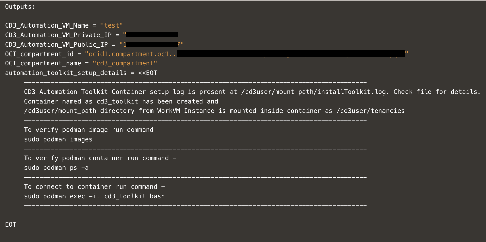
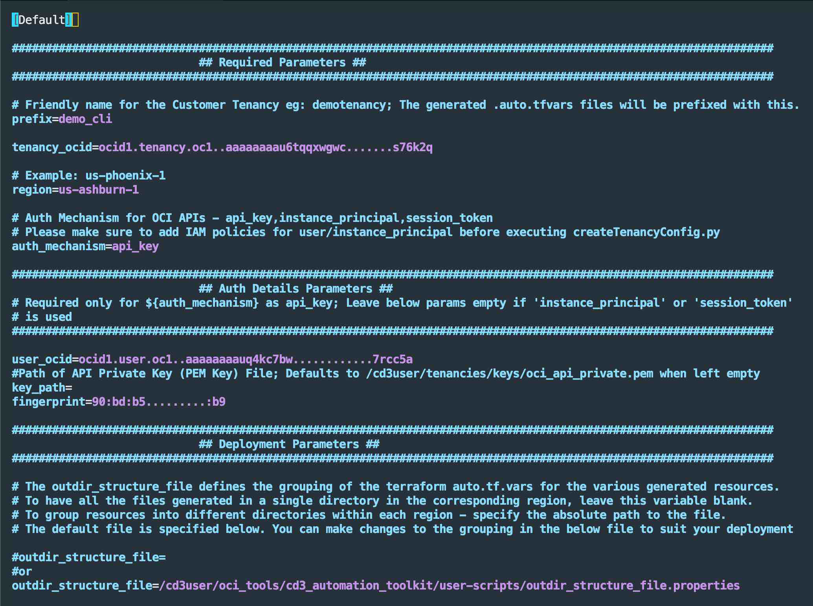
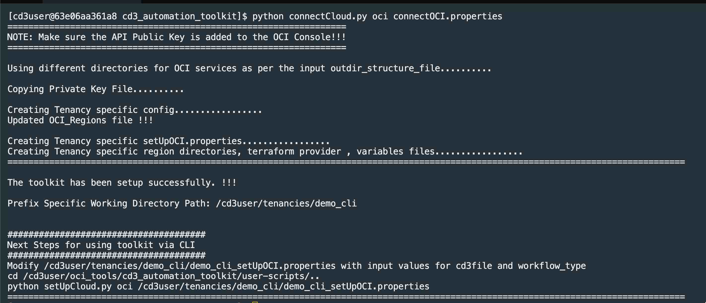
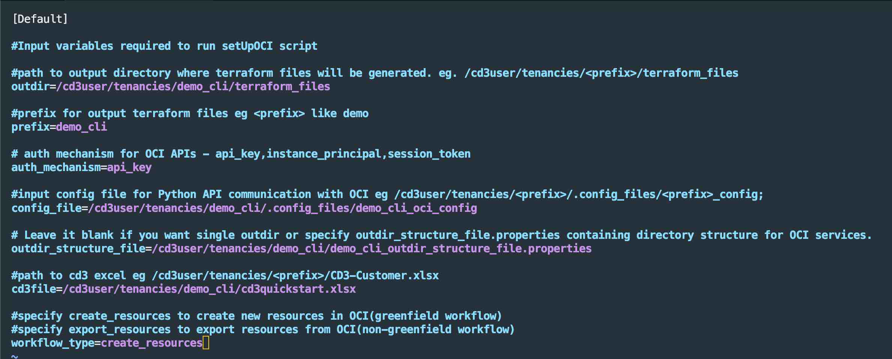
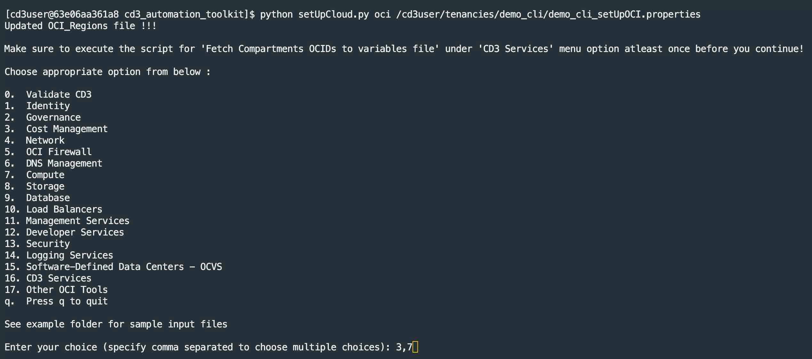
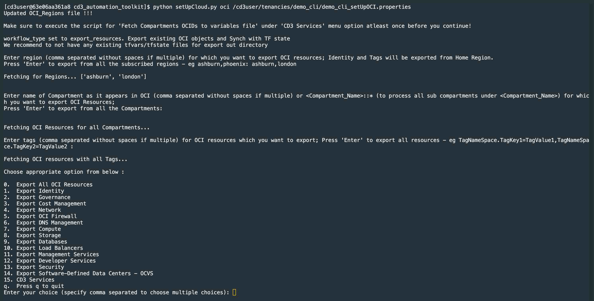

# Configure CD3 Toolkit with CLI to Create and Export Oracle Cloud Infrastructure Resources


### Objectives

- Launch the CD3 container resource manager stack with a single click and create OCI Networking and OCI Compute resources using CD3 CLI.

- Export OCI Networking and OCI Compute resources using CD3 CLI.

### Prerequisites

- Oracle Cloud Infrastructure Identity and Access Management (OCI IAM) policy to allow user or instance principal to manage the services that are required to be created or exported using the toolkit.

- The user deploying the stack should have access to launch OCI Resource Manager stack, OCI Compute instance and OCI Networking resources.

## Task 1: Set up the Toolkit Container

1. Click **Deploy to Oracle Cloud** to launch the OCI Resource Manager stack that provisions the CD3 workVM.

     [](https://cloud.oracle.com/resourcemanager/stacks/create?zipUrl=https://github.com/oracle-devrel/cd3-automation-toolkit/archive/refs/heads/main.zip)

2. Accept the terms and conditions, then provide the required details, including the Network, Compartment, VM Name, and Shape.

     > **Note:** For security, specify a restricted source CIDR range to access the VM. Avoid using `0.0.0.0/0`.

3. Check the **Run Apply** section and click **Create** to deploy the stack

4. After the **Apply** job completes successfully, open the job logs and scroll to the end.

5. Locate the details for the created VM and commands required to log in to the toolkit container. The following image shows a sample output.

    

6.  After logging in to the container using `sudo podman exec -it cd3_toolkit bash`, proceed to Task 2 to connect the toolkit to your OCI tenancy.

## Task 2: Connect the Container to your OCI Tenancy

1. Inside the container, navigate to `cd3_automation_toolkit folder` and open the `connectOCI.properties` file .
    ```
    cd /cd3user/oci_tools/cd3_automation_toolkit/
    ```

2. Add the required configuration values in the **Required parameters** and **Auth Details Parameters** sections.

     > **Note:** This tutorial uses API key authentication. Leave the `auth_mechanism` parameter at its default value.

3. Go to the OCI Console, under **User settings**, upload public key to **APIkeys**. Fetch the required config values and update under the corresponding parameters in `connectOCI.properties` file.Place the associated private key in the container.

4. Leave the default value for the `outdir_structure_file` parameter. This setting organizes the generated `auto.tfvars` files into service-specific directories.


     

     >Note: Leave the **Advanced Parameters for DevOps** section unchanged since Jenkins set up is not in the scope of this tutorial. To run the toolkit using Jenkins, checkout <a href="../quickstart_jenkins"><u>Create and Export OCI Resources Using Jenkins</u></a> 

5. Save the file and run `connectCloud.py oci` to initialize the environment and start using CD3.

     ```
     python connectCloud.py oci connectOCI.properties
     ```

6. Verify that the initialization completes successfully.

       

   After the environment is initialized, proceed to Task 3 to create OCI resources or Task 4 to export existing OCI resources.

## Task 3: Create Resources

### Task 3.1: Prepare the Excel template and Variables File

1. Download the prefilled Excel template and update the Region and Compartment values to match your OCI environment

    <style>
    .small-download-btn {
    width: auto !important;
    display: inline-block !important;
    padding: 0.35rem 0.8rem !important;
    line-height: 1.2 !important;
    min-width: unset !important;
    white-space: nowrap !important;
    transform: none !important;
    }
    .small-download-btn:hover {
    transform: none !important;
    }
    </style>
    <a href="../assets/cd3quickstart.xlsx" download class="md-button small-download-btn">Download cd3quickstart.xlsx</a>


2. Copy the Excel file inside the container at `/cd3user/tenancies/<prefix>/` using below scp command.

    ```
    scp -i <ssh_private_key_path> /Users/xyz/cd3quickstart.xlsx cd3user@<workvm_ip>:/cd3user/mount_path/tenancies/<prefix>/cd3quickstart.xlsx
    ```

    > **Note:** The **tenancies** folder in the CD3 container is mapped to the `/cd3user/mount_path/tenancies/` folder in the compute VM. Log in with `cd3user` to avoid permission issues.


3. Open `/cd3user/tenancies/<prefix>/terraform_files/<region>/compute/variables_<region>.tf` from the container. Under the `instance_ssh_keys` variable, add the SSH public key variable referenced in the Excel template (ssh_public_key) and assign the corresponding key value.

     

4. Under the `instance_source_ocids` variable, add the source image variable referenced in the Excel template (myimageocid) and assign the corresponding image OCID.


     

### Task 3.2: Run the `setUpCloud.py` Script to Generate Resource Terraform Files

1. Open the `/cd3user/tenancies/<prefix>/<prefix>_setUpOCI.properties` file and add the CD3 excel file path under the `cd3file` variable. Set `workflow_type` variable to `create_resources` and save the file.

     

2. Change the directory to `cd /cd3user/oci_tools/cd3_automation_toolkit/` and run the `setUpCloud.py` script.

    ```
    python setUpCloud.py oci /cd3user/tenancies/<prefix>/<prefix>_setUpOCI.properties
    ```

    > **Note:** If you are running the script for the first time, select **y** for the **Execute Script to fetch the compartment OCIDs into variables file** prompt .

     

3. From the menu, select:
    - <b>Network</b> → <b>Create Network</b> to generate Terraform files for VCNs and subnets.
    - <b>Compute</b> → <b>Add/Modify/Delete Instances/Boot Backup Policy</b> to generate Terraform files for compute instances.


4. Navigate to the network Terraform directory and provision the networking resources.

    ```
    cd /cd3user/tenancies/<prefix>/terraform_files/<region>/network/
    ```

    ```
    terraform init
    terraform plan -out tfplan
    terraform apply tfplan
    ```

5. **Create Network** generates Security/Route rules in the VCN that are not initially present in the CD3 Excel template (as these details are initially taken from the subnets tab). <br> To synchronize them to the Security Rules and Route Rules sheets in Excel file, run the `setUpCloud.py` script again using the same Excel sheet as above. Ensure that `workflow_type` remains set to `create_resources` in the `<prefix>_setUpOCI.properties` file. Select **Network** under main options and then the below sub-options.

    ```
    Security Rules  ---> Export Security Rules (From OCI into SecRulesinOCI sheet), Add/Modify/Delete Security Rules (Reads SecRulesinOCI sheet)

    Route Rules     ---> Export Route Rules (From OCI into RouteRulesinOCI sheet), Add/Modify/Delete Route Rules (Reads RouteRulesinOCI sheet)

    DRG Route Rules ---> Export DRG Route Rules (From OCI into DRGRouteRulesinOCI sheet), Add/Modify/Delete DRG Route Rules (Reads DRGRouteRulesinOCI sheet)
    ```

6. Once exported, The `SecRulesinOCI`, `RouteRulesinOCI`, and `DRGRouteRulesinOCI` sheets are populated in the Excel template.
    
    The following Terraform variable files are generated:<br>
    `<prefix>_seclists.auto.tfvars`<br>
    `<prefix>_routetables.auto.tfvars`<br>
    `<prefix>_drg-routetables.auto.tfvars`<br>

    These files are located under:

    `/cd3user/tenancies/<prefix>/terraform_files/<region>/network/`


7. Verify `terraform plan` and `terraform apply`. Running terraform apply completes the export of security rules, route rules and DRG route rules from OCI. The terraform state is now synchronized with OCI.

8. To provision compute resources, change the directory to `/cd3user/tenancies/<prefix>/terraform_files/<region>/compute/` and run the Terraform commands.

    ```
    terraform init
    terraform plan -out tfplan
    terraform apply tfplan
    ```

   Verify that the networking and compute resources have been successfully provisioned in the OCI Console.

## Task 4: Export Resources

### Task 4.1: Add Excel Template to the Container

1. Download [CD3-Blank-template](https://github.com/oracle-devrel/cd3-automation-toolkit/blob/main/cd3_automation_toolkit/example/CD3-Blank-template.xlsx) and add it to the container at `/cd3user/tenancies/<prefix>/`.

    ```
    scp -i <ssh_private_key_path> /Users/xyz/CD3-Blank-template.xlsx cd3user@<workvm_ip>:/cd3user/mount_path/tenancies/<prefix>/CD3-Blank-template.xlsx
    ```

    >**Note:** The **tenancies** folder in cd3 container is mapped to the `/cd3user/mount_path/tenancies/` folder in the CD3 work VM. Log in with `cd3user` to avoid permission issues.

2. Navigate to the `/cd3user/tenancies/<prefix>/` folder and open the `<prefix>_setUpOCI.properties` file.

3. Add the CD3 Excel file path under the variable `cd3file`.

4. Set the `workflow_type` parameter to `export_resources` and save the file.

### Task 4.2: Run the `setUpCloud.py` Script

1. Navigate to `cd /cd3user/oci_tools/cd3_automation_toolkit/` and run the `setUpCloud.py` script.

    ```
    python setUpCloud.py oci /cd3user/tenancies/<prefix>/<prefix>_setUpOCI.properties
    ```

    >**Note:** If you are running the script for the first time, select **y** for the **Execute Script to fetch the compartment OCIDs into variables file** prompt.

     

2. Provide comma separated `region` values if you have to export resources from multiple regions. If no region value is provided, the toolkit will export resources from all subscribed regions.

3. Select the resource types to be exported (**Network** and **Compute**). You can choose to export the resources only from specific compartments or all compartments. If the compartment name is not unique, it should be specified in the following format based on the hierarchy.

    ```
    Parent Compartment::Child Compartment1::Child Compartment2
    ```

4. To export only specific resources, provide the requested filter values when prompted.

    > **Note:** For additional information, see:<br>
     - [Export OCI Networking Resources](https://oracle-devrel.github.io/cd3-automation-toolkit/latest/manage-network/#export-existing-network-resources-from-oci-non-greenfield-workflow)<br>
     - [Export OCI Compute Resources](https://oracle-devrel.github.io/cd3-automation-toolkit/latest/manage-compute/#export-existing-compute-resources-from-oci-non-greenfield-workflow)

5. After successful completion, the exported resource data is populated in the input Excel file. The updated Excel file is present under the `/cd3user/tenancies/<prefix>` folder inside the container and needs to be copied manually to the local system using scp command.

    ```
    scp -i <ssh_private_key> cd3user@<workvm_ip>:/cd3user/mount_path/tenancies/<prefix>/CD3-Blank-template.xlsx /Users/xyz/CD3-export.xlsx
    ```

6. CD3 generates service-specific `.tfvars` files and terraform import shell scripts in the corresponding service directories. These files are used to sync the resources into Terraform state.

   - `/cd3user/tenancies/<prefix>/terraform_files/<region_dir>/network/`

   - `/cd3user/tenancies/<prefix>/terraform_files/<region_dir>/compute/`


### Task 4.3: Import Resources into Terraform State

1. From the **network** and **compute** service folders, execute each of the generated `.sh` files containing Terraform import commands.

    > **Note:** For OCI Networking, ensure to run the `sh import_commands_network_major-objects.sh` first

2. After all import scripts have run successfully, the Terraform state is populated with the exported OCI resources and the Terraform configuration is synchronized with the current OCI environment.

The generated Terraform code can be deployed using OCI Resource Manager or integrated into your organization's CI/CD workflows for ongoing infrastructure management.


