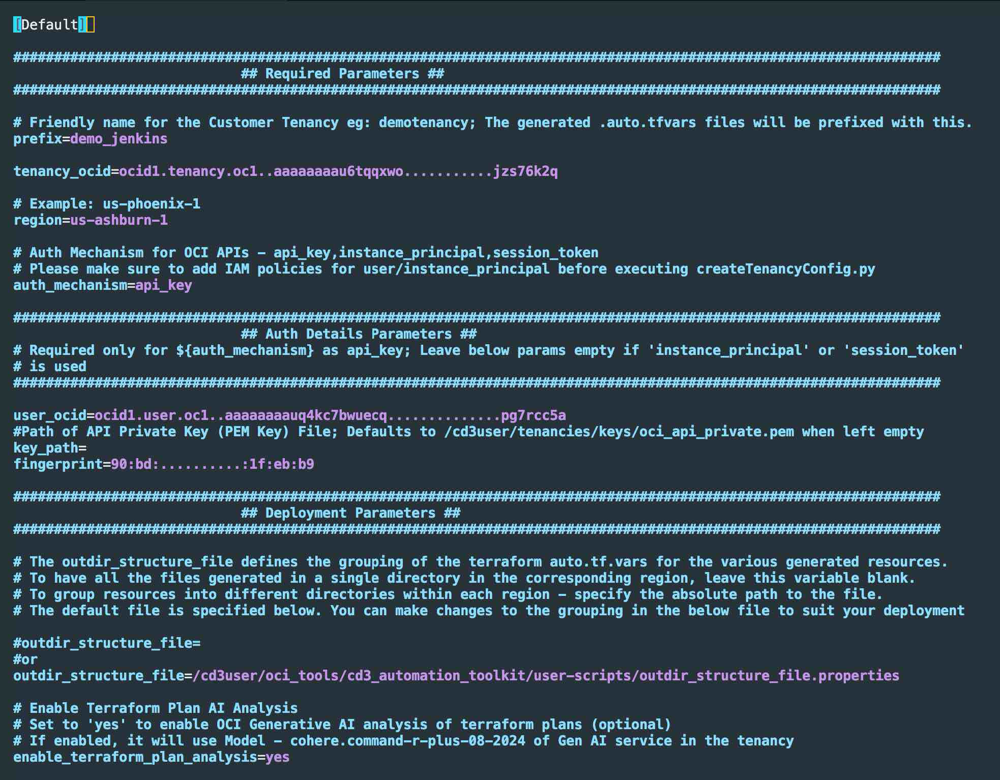
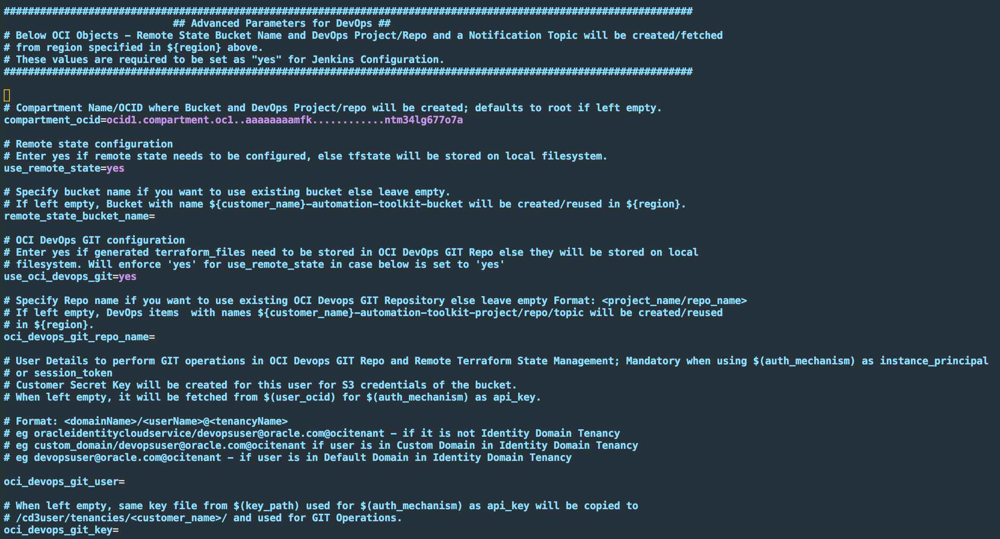
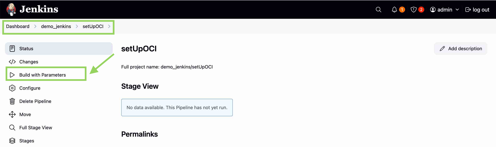
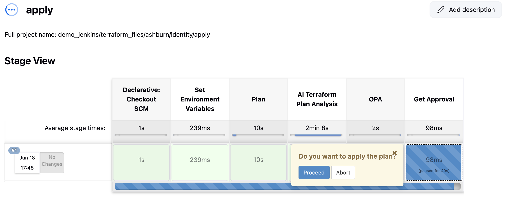
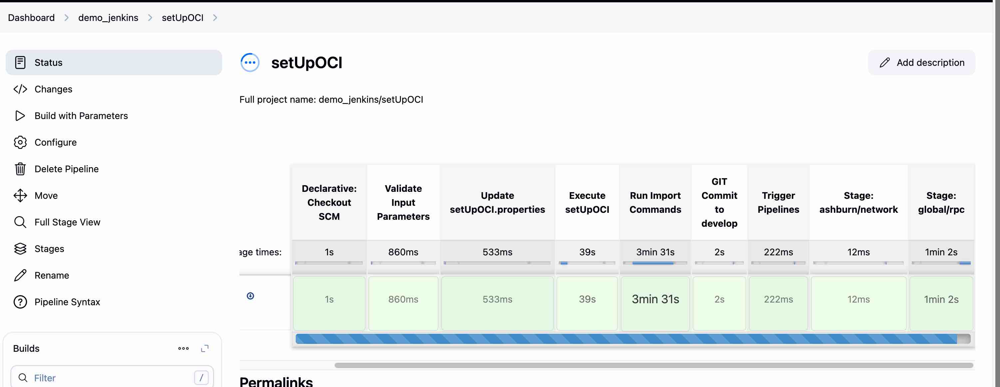

# Configure CD3 with Jenkins to Create and Export Oracle Cloud Infrastructure Resources

### Objectives

- Launch the CD3 container with a single click and then create, export OCI identity, network, and compute resources using Jenkins pipelines.

### Prerequisites

- Oracle Cloud Infrastructure Identity and Access Management (OCI IAM) policy to allow user or Instance principal to manage the services that are required to be created or exported using the toolkit.

- The user deploying the stack should have access to launch OCI Resource Manager stack, Compute instance and Network resources.

## Task 1: Set up the Toolkit Container

1. Click **Deploy to Oracle Cloud** to launch the OCI Resource Manager stack that creates the CD3 WorkVM.

   [](https://cloud.oracle.com/resourcemanager/stacks/create?zipUrl=https://github.com/oracle-devrel/cd3-automation-toolkit/archive/refs/heads/main.zip)

2. Accept the terms and conditions. Enter the network, compartment, VM name, shape and so on, for the workVM to be created.

   > **Note:** For security, specify a restricted source CIDR range to access the VM. Avoid using `0.0.0.0/0`.

3. Check the **Run Apply** section and click **Create** to deploy the stack

4. After the **Apply** job completes successfully, open the job logs and scroll to the end.

5. Locate the details for the created VM and commands required to log in to the toolkit container. The following image shows a sample output.
 
     

6. After logging in to the container using `sudo podman exec -it cd3_toolkit bash`, proceed to Task 2 to connect the toolkit to your OCI tenancy.  


## Task 2: Connect the Container to OCI Tenancy

1. Inside the container, navigate to `cd3_automation_toolkit folder` and open the `connectOCI.properties` file .
    ```
    cd /cd3user/oci_tools/cd3_automation_toolkit/
    ```

2. Add the required configuration values in the **Required parameters** and **Auth Details Parameters** sections.

     > **Note:** This tutorial uses API key authentication. Leave the `auth_mechanism` parameter at its default value.

3. Go to the OCI Console, under **User settings**, upload public key to **APIkeys**. Fetch the required config values and update under the corresponding parameters in `connectOCI.properties` file.Place the associated private key in the container.

4. Leave the default value for the `outdir_structure_file` parameter. This setting organizes the generated `auto.tfvars` files into service-specific directories.

      

5. Update `enable_terraform_plan_analysis` parameter value as required. 

6. Under **Advanced Parameters for DevOps**, Provide a compartment ocid to create the supporting resources. Select `yes` for the `use_remote_state` and `use_oci_devops_git` parameters.

      

     This will create an **OCI DevOps Git Repository** for the generated terraform files, **OCI Object Storage bucket** for the state file and an **OCI Notification topic** to notify for the changes in DevOps repo.

7. Save the file and run `connectCloud.py oci` to initialize the environment and start using CD3.

     ```
     python connectCloud.py oci connectOCI.properties
     ```

8. Verify that the initialization completes successfully.


After the environment is initialized, proceed to Task 3 to create OCI resources or Task 4 to export existing OCI resources.


## Task 3: Create Resources in OCI

### Task 3.1: Prepare Excel and Variables File

1. Download the prefilled Excel template and update the Region and Compartment values to match your OCI environment

    <style>
    .small-download-btn {
    width: auto !important;
    display: inline-block !important;
    padding: 0.35rem 0.8rem !important;
    line-height: 1.2 !important;
    min-width: unset !important;
    white-space: nowrap !important;
    transform: none !important;
    }
    .small-download-btn:hover {
    transform: none !important;
    }
    </style>
    <a href="../assets/cd3quickstart.xlsx" download class="md-button small-download-btn">Download cd3quickstart.xlsx</a>

2. Open `/cd3user/tenancies/<prefix>/terraform_files/<region>/compute/variables_<region>.tf` from the container. Under the `instance_ssh_keys` variable, add the SSH public key variable referenced in the Excel template (ssh_public_key) and assign the corresponding key value.
     

3. Under the `instance_source_ocids` variable, add the source image variable referenced in the Excel template (myimageocid) and assign the corresponding image OCID.


     

4. After updating the Terraform variables, run the following commands to synchronize the local changes with the OCI DevOps Git repository:

    ```
    cd /cd3user/tenancies/<prefix>/terraform_files
    git status
    git add -A .
    git commit -m "msg"
    git push
    ```

### Task 3.2: Log in to Jenkins and Execute setupoci Pipeline

1. Start Jenkins and access it using the following commands from the container.

   - To start Jenkins, use the `/usr/share/jenkins/jenkins.sh &` command.

   - To access Jenkins, use this url `https://<IP Address of the machine hosting docker container>:8443`.

2. Log in to Jenkins. On the dashboard, folders with `<prefix>` names are present. Click the `<prefix>` name you are working with. It has the corresponding setupoci pipeline and `terraform_files` folder. Click **setupoci pipeline** and **Build with Parameters**.

     > **Note:** If accessing the Jenkins URL for the first time, set up log in credentials.

     

3. Under the **Excel template** section, upload the excel file fetched in Task 3.1.

4. Under **Workflow**, select **Create New Resources in OCI (Greenfield Workflow)**.

4. Under **MainOptions**, select **Identity**, **Network** and **Compute**.

5. Under **SubOptions**, select **Add/Modify/Delete Groups**, **Add/Modify/Delete Policies**, **Create Network**, **Add/Modify/Delete Instances/Boot Backup Policy**.

6. Click **Build**. The setupoci pipeline stages are executed in order.

### Task 3.3: Provide Approval for Each Service Plan

1. Click on the identity stage for logs and click on the link to identity apply pipeline build. Under **Get Approval** stage, click logs and select **Proceed**. Check the logs under **Apply** stage to verify the created identity resources.

     

2. Similarly, from the network stage in setupoci pipeline, click logs and then the link for network apply pipeline build. Under **Get Approval** stage, click logs and select **Proceed**. Check the logs under **Apply** stage to verify the created network resources.

3. Click the compute stage logs. Click the link to compute apply pipeline build.

     > **Important:** The initial Compute pipeline may fail because Network resources must be created first. Rerun the Compute pipeline after the Network Apply Pipeline completes successfully. The next step shows how to execute this.

4. Click **Build Now** for the compute apply pipeline. After the pipeline stages start executing, under **Get Approval** stage, click logs and select **Proceed**. Check the logs under **Apply** stage to verify the created compute resources.

5. **Create Network** generates Security/Route rules in the VCN that are not initially present in the CD3 Excel template (as these details are initially taken from the subnets tab). <br> To synchronize them to the Security Rules and Route Rules sheets in Excel file, build **setupoci Pipeline** again using the same Excel sheet as above, set workflow to **Create Resources in OCI**,  select **Network** under main options and then the below sub-options. 

      ```
      Security Rules  ---> Export Security Rules (From OCI into SecRulesinOCI sheet), Add/Modify/Delete Security Rules (Reads SecRulesinOCI sheet) 

      Route Rules     ---> Export Route Rules (From OCI into RouteRulesinOCI sheet), Add/Modify/Delete Route Rules (Reads RouteRulesinOCI sheet)

      DRG Route Rules ---> Export DRG Route Rules (From OCI into DRGRouteRulesinOCI sheet), Add/Modify/Delete DRG Route Rules (Reads DRGRouteRulesinOCI sheet)
      ```

6. Specify the Compartment name. Click on **Build** and the **setupoci Pipeline** stages start executing.

7. The Excel sheet will be populated with Security Rules, Route Rules, DRG Route Rules data. Terraform `tfvars` files are generated for these resources. 

8. The updated Excel file containing exported data from OCI is present under **Build Artifacts** of the particular setupoci build. The Excel file is also present inside the container under `/cd3user/tenancies/<prefix>/`. 
 
9. Click on the **Network** stage logs and click on the link to Network apply pipeline build. The terraform plan should show **No changes** inferring these services in OCI and CD3 are in sync.

10. This completes the resource creation process in OCI. Verify the resources that are created on the OCI console.
 

## Task 4: Export Resources from OCI

### Task 4.1: Download `CD3-Blank-template.xlsx` File

1. Download the CD3 Blank template from here: [CD3-Blank-template.xlsx](https://github.com/oracle-devrel/cd3-automation-toolkit/blob/main/cd3_automation_toolkit/example).

### Task 4.2: Log in to Jenkins 

1. Start Jenkins and access it using the following commands from the container.

   1. To start Jenkins, use the `/usr/share/jenkins/jenkins.sh &` command.

   2. To access Jenkins, use this url `https://<IP Address of the machine hosting docker container>:8443`.

2. Log in to Jenkins.

     > **Note:** If accessing the Jenkins URL for the first time, set up log in credentials.

### Task 4.3: Execute setupoci Pipeline 

1. On the Jenkins dashboard, folders with `<prefix>` names are present. Click the `<prefix>` name you are working with. It has the corresponding setupoci pipeline and `terraform_files` folder. Click **setupoci pipeline** and **Build with Parameters**.

2. Under the **Excel template** section, upload the Excel file fetched in Task 4.1.

3. Under **Workflow**, select **Export Existing Resources from OCI (Non-Greenfield Workflow)**.

4. Under **MainOptions**, select **Export Identity**, **Export Network** and **Export Compute**.

5. Under **SubOptions**, select **Export Compartments/Groups/Policies** for identity and **Export all Network Components** for network and **Export Instances (excludes instances launched by OKE)** for compute.

     > **Note:** Add details under **AdditionalFilters** if required, to filter resources.

6. Click **Build**. The setupoci pipeline stages are executed in order for each of the services.

     

7. Check logs under **Run Import Commands** stage. If it shows as successful, the corresponding terraform pipelines **Plan** stage should indicate **No Changes**. 

     > **Note:** If you find any changes in the plan, review them and apply as needed.

8. The updated Excel file containing exported data from OCI is present under **Build Artifacts** of the particular setupoci build. The Excel file is also present inside the container under `/cd3user/tenancies/<prefix>`.


