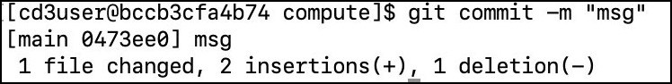

# Switch between using the toolkit via CLI and Jenkins UI

!!! note
    It is recommended to stick to using the toolkit either via CLI or via Jenkins.***

There can be scenarios when you need to update the **terraform_files** folder manually via CLI. Below are some examples:

- You executed setUpOCI script to generate tfvars for some resources via CLI.
- You updated **variables_<region\>.tf** file to update image OCID or SSH Key for Compute or Database etc.

Please follow below steps to sync local terraform_files folder to OCI DevOps GIT Repo:

- ```cd /cd3user/tenancies/<customer_name>/terraform_files```

- ```git status```
  <br>Below screenshot shows changes in variables_phoenix.tf file under phoenix/compute folder.
  
    

- ```git add -A .```

- ```git commit -m "msg"```
  
    

- ```git push```
  
    

