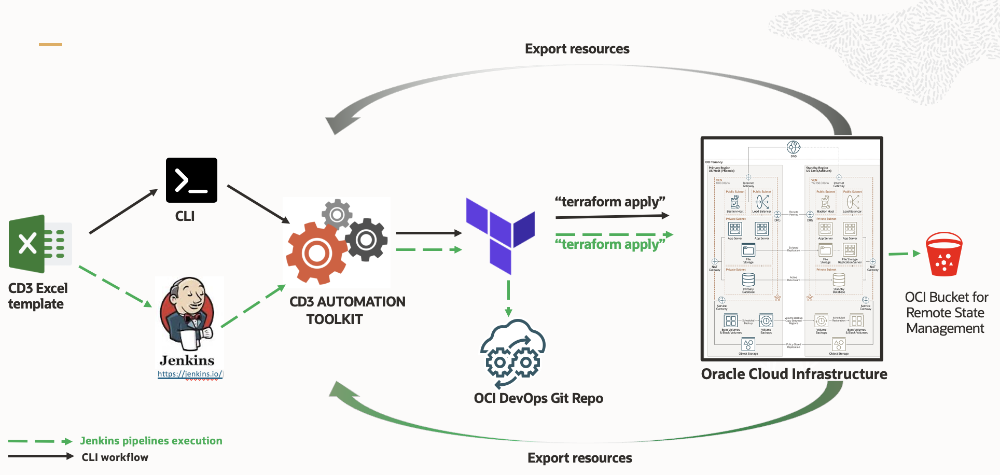
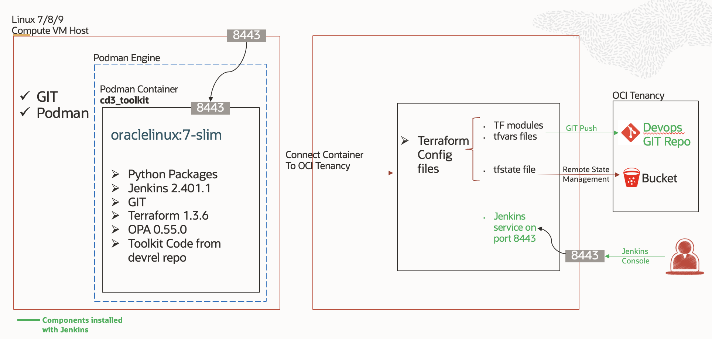

# **Getting Started**
---

##<u> **CD3 Toolkit Process</u>**

 

First, The Excel file is input to the CD3 Automation toolkit using either CLI or Jenkins.  

>Note: 📖 Detailed documentations and videos are provided for both options. Please check the left panel for navigation.

###**Create resources**

- The input Excel file is processed by the toolkit and terraform *auto.tfvars files are generated for all those reosurces. 

- The generated terraform files can be used to deploy resources in OCI by generating a terraform plan and approving the plan for apply. 

###**Export resources**

- The input Excel (preferably the Blank template) is processed by the toolkit and resources are exported to CD3 Excel template. 

- The toolkit then generates *auto.tfvars from the exported data in Excel file and also generates shell scripts with terraform import commands for all the reosurces.

- The shell scripts have to be executed in order to have the updated state file to manage the resources further.

###**Modify resources**

- Resources created or exported using toolkit can be modified at any point of time using the same Excel file.

###**Excel Sheet Templates**

- Here are the [templates](ExcelTemplates.md).

 

##<u> **CD3 Toolkit Architecture</u>**

 

##<u> **CD3 Toolkit Supported Services in OCI</u>**

| OCI Services | Details |
| --------- | ----------- |
| [IAM/Identity](CD3ExcelTabs.md#iamidentity) | Compartments, Groups, Dynamic Groups, Policies, Users, Network Sources |
| [Governance](CD3ExcelTabs.md#governance) | Tags (Namespaces, Tag Keys, Defined Tags, Default Tags, Cost Tracking) |
| [Network](CD3ExcelTabs.md#network) | VCNs, Subnets, VLANs, DRGs, IGWs, NGWs, LPGs, Route Tables, DRG Route, Tables, Security Lists, Network Security Groups, Remote Peering Connections, Application Load Balancer, Network Load Balancers |
| [DNS Management](CD3ExcelTabs.md#private-dns)                                       | Private DNS - Views, Zones, rrsets/records and Resolvers  |
| [Compute](CD3ExcelTabs.md#compute) | Instances supporting Market Place Images, Remote Exec, Cloud-Init scripts, Dedicated VM Hosts |
| [Storage](CD3ExcelTabs.md#storage) | FSS, Block and Boot Volumes, Backup Policies, Object Storage Buckets and logging for write events |
| [Database](CD3ExcelTabs.md#database) | Exa Infra, ExaCS, DB Systems VM and BM, ATP, ADW |
| [Observability and Management](CD3ExcelTabs.md#management-services) | Events, Notifications, Alarms, Service Connector Hub (SCH) |
| [Developer Services](CD3ExcelTabs.md#developer-services) | Resource Manager, Oracle Kubernetes Engine (OKE) |
| [Logging Services](CD3ExcelTabs.md#logging-Services) | VCN Flow Logs, LBaaS access and error Logs, OSS Buckets write Logs |
| [SDDCs ](CD3ExcelTabs.md#sddcs-tab) | Oracle Cloud VMWare Solutions (Single Cluster is supported as of now. Multi-cluster support will be included in the upcoming release) |
| [CIS Landing Zone Compliance](CISFeatures.md#additional-cis-compliance-features) | Download and Execute CIS Compliance Check Script, Cloud Guard, Key Vault, Budget |
[Policy Enforcement](OPAForCompliance.md) | OPA - Open Policy Agent |
