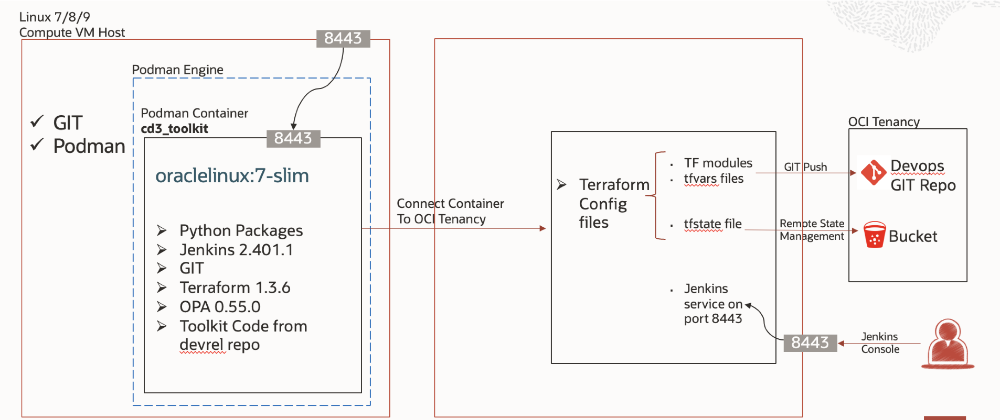

# CD3 Automation Toolkit

The CD3 toolkit reads input data in the form of CD3 Excel sheet and generates Terraform files which can be used to provision the resources in OCI instead of handling the task through the OCI console manually. The toolkit also reverse engineers the components in OCI back to the Excel sheet and Terraform configuration. The toolkit can be used throughout the lifecycle of tenancy to continuously create or modify existing resources. The generated Terraform code can be used by the OCI Resource Manager or can be integrated into organization's existing devops CI/CD ecosystem.

 

## 📌 OCI Services Currently Supported by Automation Toolkit

| OCI Services | Details |
| --------- | ----------- |
| [IAM/Identity](CD3ExcelTabs.md#iamidentity) | Compartments, Groups, Dynamic Groups, Policies, Users, Network Sources |
| [Governance](CD3ExcelTabs.md#governance) | Tags (Namespaces, Tag Keys, Defined Tags, Default Tags, Cost Tracking) |
| [Network](CD3ExcelTabs.md#network) | VCNs, Subnets, VLANs, DRGs, IGWs, NGWs, LPGs, Route Tables, DRG Route, Tables, Security Lists, Network Security Groups, Remote Peering Connections, Application Load Balancer, Network Load Balancers |
| [DNS Management](CD3ExcelTabs.md#private-dns)                                       | Private DNS - Views, Zones, rrsets/records and Resolvers  |
| [Compute](CD3ExcelTabs.md#compute) | Instances supporting Market Place Images, Remote Exec, Cloud-Init scripts, Dedicated VM Hosts |
| [Storage](CD3ExcelTabs.md#storage) | FSS, Block and Boot Volumes, Backup Policies, Object Storage Buckets and logging for write events |
| [Database](CD3ExcelTabs.md#database) | Exa Infra, ExaCS, DB Systems VM and BM, ATP, ADW |
| [Observability and Management](CD3ExcelTabs.md#management-services) | Events, Notifications, Alarms, Service Connector Hub (SCH) |
| [Developer Services](CD3ExcelTabs.md#developer-services) | Resource Manager, Oracle Kubernetes Engine (OKE) |
| [Logging Services](CD3ExcelTabs.md#logging-Services) | VCN Flow Logs, LBaaS access and error Logs, OSS Buckets write Logs |
| [SDDCs ](CD3ExcelTabs.md#sddcs-tab) | Oracle Cloud VMWare Solutions (Single Cluster is supported as of now. Multi-cluster support will be included in the upcoming release) |
| [CIS Landing Zone Compliance](CISFeatures.md#additional-cis-compliance-features) | Download and Execute CIS Compliance Check Script, Cloud Guard, Key Vault, Budget |
[Policy Enforcement](OPAForCompliance.md) | OPA - Open Policy Agent |

 

## 🔄 High level workflow

 

First, The Excel file is input to the CD3 Automation toolkit using either CLI or Jenkins.  

>Note: 📖 Detailed documentations and videos are provided for both options. Please check the left panel for navigation.

**Create resources:**

- The input Excel file is processed by the toolkit and terraform *auto.tfvars files are generated for all those reosurces. 

- The generated terraform files can be used to deploy resources in OCI by generating a terraform plan and approving the plan for apply. 

**Export resources**

- The input Excel (preferably the Blank template) is processed by the toolkit and resources are exported to CD3 Excel template. 

- The toolkit then generates *auto.tfvars from the exported data in Excel file and also generates shell scripts with terraform import commands for all the reosurces.

- The shell scripts have to be executed in order to have the updated state file to manage the resources further.

**Modify resources**

- Resources created or exported using CD3 can be modified at any point of time using the same Excel file.

 

## 🔧 CD3 Architecture with Jenkins

 

## 📜  Excel Sheet Templates
CD3 Excel sheet is the main input for Automation Toolkit.

Below are the CD3 templates for the latest release having standardised IAM Components (compartments, groups and policies), Network Components and Events & Notifications Rules as per CIS Foundations Benchmark for Oracle Cloud.

Details on how to fill data into the Excel sheet can be found in the Blue section of each sheet inside the Excel file. Make appropriate changes to the templates eg region and use for deployment.

 

**CD3 Excel templates for OCI core services:**

|Excel Sheet  | Purpose                                                                                                                    | 
|-----------|----------------------------------------------------------------------------------------------------------------------------|
| [CD3-Blank-template.xlsx](https://github.com/oracle-devrel/cd3-automation-toolkit/blob/main/cd3_automation_toolkit/example/CD3-Blank-template.xlsx)   | 	Choose this template while exporting the existing resources from OCI into the CD3 and Terraform.| 
| [CD3-CIS-template.xlsx](https://github.com/oracle-devrel/cd3-automation-toolkit/blob/main/cd3_automation_toolkit/example/CD3-CIS-template.xlsx)      | This template has auto-filled in data of CIS Landing Zone for DRGv2. Choose this template to create Core OCI Objects (IAM, Tags, Networking, Instances, LBR, Storage, Databases) |
|[CD3-HubSpoke-template.xlsx](https://github.com/oracle-devrel/cd3-automation-toolkit/blob/main/cd3_automation_toolkit/example/CD3-HubSpoke-template.xlsx)        | This template has auto-filled in data for a Hub and Spoke model of networking. Choose this template to create Core OCI Objects (IAM, Tags, Networking, Instances, LBR, Storage, Databases)|
|[CD3-SingleVCN-template.xlsx](https://github.com/oracle-devrel/cd3-automation-toolkit/blob/main/cd3_automation_toolkit/example/CD3-SingleVCN-template.xlsx)      | This template has auto-filled in data for a Single VCN model of networking. Choose this template to create Core OCI Objects (IAM, Tags, Networking, Instances, LBR, Storage, Databases)|

**CD3 Excel templates for OCI Observability and Management services:** 

|Excel Sheet| Purpose                                                                                                                    | 
|-----------|----------------------------------------------------------------------------------------------------------------------------|
|[CD3-CIS-ManagementServices-template.xlsx](https://github.com/oracle-devrel/cd3-automation-toolkit/blob/main/cd3_automation_toolkit/example/CD3-CIS-ManagementServices-template.xlsx) | This template has auto-filled in data of CIS Landing Zone. Choose this template while creating the components of Events, Alarms, Notifications and Service Connectors

**NOTE:**

* The Excel Templates can also be found at "_/cd3user/oci_tools/cd3_automation_toolkit/example_" folder  inside the container.
* After deploying the infra using any of the templates, please run [CIS compliance checker script](CISFeatures.md)

Please refer to the **"GETTING-STARTED"** sections in the navigation panel to start your journey with the toolkit. Happy Automation!!

