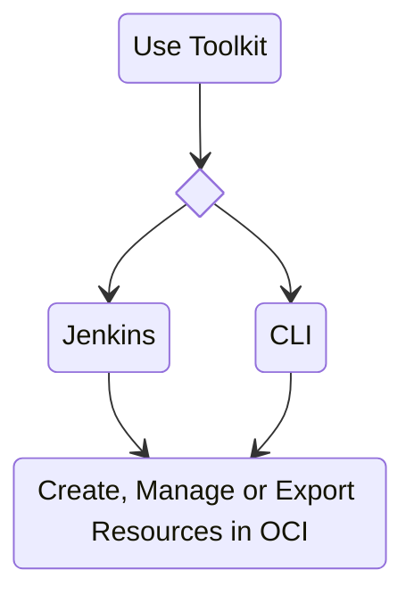

# **Connect container to OCI Tenancy**
---

!!! note 

    * It is recommended to execute createTenancyConfig.py with a single ```customer_name``` within that container. Even if it is run multiple times with different customer names, Jenkins will only be configured for  ```<customer_name>``` used while first time successful execution of the script.
    * If there is a new region subscription to the tenancy at a later stage of time, createTenancyConfig.py must be re-run by using the same tenancyconfig.properties file that was originally used to create the   configuration. Re-execution will create new directory for the new region under `/cd3user/tenancies/<customer_name>/terraform_files` without touching the existing ones and will commit the latest terraform_files     folder to DevOps GIT repo.

**Step 1 - Exec into the Container**:

* Run  ```docker ps```<br>
→ Note down the container ID from this cmd output.<br>
* Run  ```docker exec -it <container_id> bash```

**Step 2 - Choose Authentication Mechanism for OCI SDK**</a>

* Please click [here](authmechanisms.md) to configure any one of the available authentication mechanisms.
  
**Step 3 - Edit tenancyconfig.properties**:

* Run ```cd /cd3user/oci_tools/cd3_automation_toolkit/user-scripts/```
* Fill the input parameters in **tenancyconfig.properties** file.
!!! must-read "Must Read"
    Ensure to:<br>
    -  Have the details ready for the Authentication mechanism you are planning to use.<br>
    -  Use the same customer_name for a tenancy even if the script needs to be executed multiple times.<br>
    -  Review **'outdir_structure_file'** parameter as per requirements. It is recommended to use seperate outdir structure to manage 
       a large number of resources. <br>
    -  Review Advanced Parameters Section for CI/CD setup and be ready with user details that will be used to connect to DevOps Repo in OCI.              Specifying these parameters as **'yes'** in properties file will create Object Storage Bucket and Devops Git Repo/Project/Topic in OCI and enable toolkit usage via Jenkins. The toolkit supports users in primary IDCS stripes or default domains only for DevOps GIT operations.<br>




 
**Step 4 - Initialise the environment**:

* Initialise your environment to use the Automation Toolkit.
<br>```python createTenancyConfig.py tenancyconfig.properties```

!!! note 
    * If you are running docker container on a linux VM host, please refer to [point no. 7](faq.md) under FAQ   to avoid any permission issues.
    * Running the above command immediately after adding API key to the user profile in OCI might result in     Authentication Errors. In such cases, please retry after a minute.
    <br>

→ Example execution of the script with Advanced Parameters for CI/CD:

> 


**Output**


Details of the files created on successful execution of above steps -

| Files Generated | At File Path | Comment/Purpose |
| --------------- | ------------ | --------------- |
| setUpOCI.properties | ```/cd3user/tenancies/<customer_name>/<customer_name>_setUpOCI.properties``` | Customer Specific properties |
| outdir_structure_file.properties | ```/cd3user/tenancies/<customer_name>/<customer_name>_outdir_structure_file``` | Customer Specific properties file for outdir structure.<br> This file will not be generated if 'outdir_structure_file' parameter was set to empty(single outdir) in tenancyconfig.properties while running createTenancyConfig.py |
| Region based directories | ```/cd3user/tenancies/<customer_name>/terraform_files``` | Tenancy's subscribed regions based directories for the generation of terraform files.<br>Each region directory will contain individual directory for each service based on the parameter 'outdir_structure_file' |
| Variables File,Provider File, Root and Sub terraform modules | ```/cd3user/tenancies/<customer_name>/terraform_files/<region>``` | Required for terraform to work. Variables file and Provider file will be genrated based on authentication mechanism chosen.|
| out file | ```/cd3user/tenancies/<customer_name>/createTenancyConfig.out``` | This file contains a copy of information displayed as the console output. |
| OCI Config File | ```/cd3user/tenancies/<customer_name>/.config_files/<customer_name>_oci_config``` | Customer specific Config file for OCI API calls. This will have data based on authentication mechanism chosen. |
| Public and Private Key Pair | Copied from ```/cd3user/tenancies/keys/```<br>to<br>```/cd3user/tenancies/<customer_name>/.config_files``` | API Key for authentication mechanism as API_Key are copied to customer specific out directory locations for easy access. |
| GIT Config File | ```/cd3user/tenancies/<customer_name>/.config_files/<customer_name>_git_config``` | Customer specific GIT Config file for OCI Dev Ops GIT operations. This is generated only if use_oci_devops_git is set to yes |
| S3 Credentials File | ```/cd3user/tenancies/<customer_name>/.config_files/<customer_name>_s3_credentials``` | This file contains access key and secret for S3 compatible OS bucket to manage remote terraform state. This is generated only if use_remote_state is set to yes |
| Jenkins Home | ```/cd3user/tenancies/jenkins_home``` | This folder contains jenkins specific data. ```Single Jenkins instance can be setup for a single container.```|
| tenancyconfig.properties | ```/cd3user/tenancies/<customer_name>/.config_files/<customer_name>_tenancyconfig.properties``` | The input properties file used to execute the script is copied to custome folder to retain for future reference. This can be used when the script needs to be re-run with same parameters at later stage.|

The next pages will guide you to use the toolkit either via CLI or via Jenkins. Please proceed further.

[Use Toolkit with CLI](#){ .md-button } [Use Toolkit with Jenkins](#){ .md-button }

